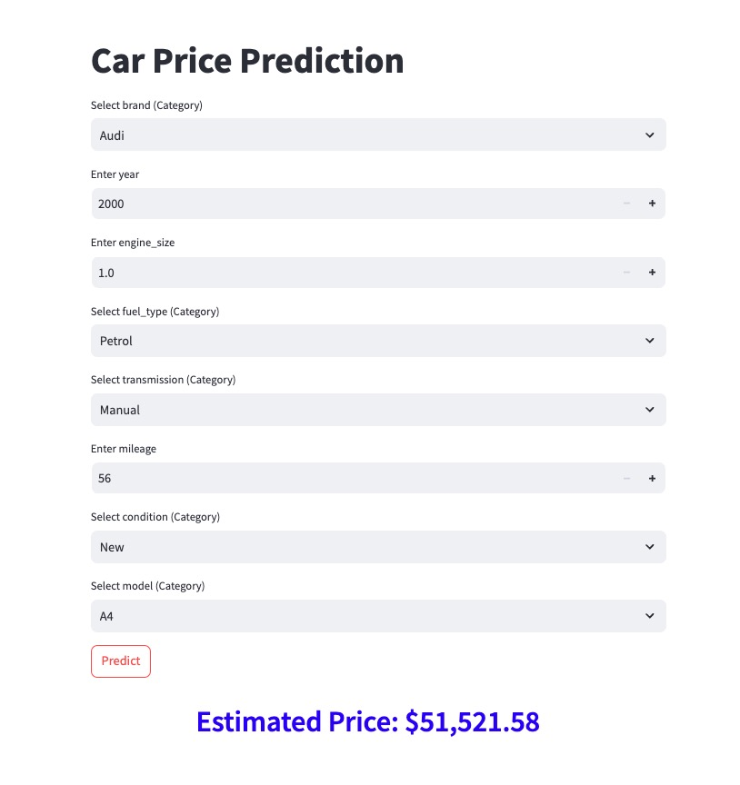

# **Car Price Prediction**

## **Overview**

This project aims to predict the price of cars based on various features, such as brand, engine size, mileage, and other attributes. By leveraging machine learning techniques, we can estimate car prices to assist buyers and sellers in making informed decisions.

The project involves:

- Data cleaning and preprocessing.
- Exploratory Data Analysis (EDA) to uncover insights.
- Training multiple regression models to predict car prices.
- Hyperparameter tuning to optimize model performance.
- Evaluating models based on performance metrics such as RMSE and \( R^2 \).

---

## **Problem Statement**

The primary challenge is to build a robust predictive model that can accurately estimate the price of a car based on its attributes. The dataset contains both categorical and numerical features, and the task involves handling these effectively for model training.

---

## **Goal**

1. Perform exploratory analysis to understand data patterns and relationships.
2. Preprocess the dataset by handling missing values, encoding categorical variables, and scaling numerical features.
3. Train and evaluate various regression models, including:
   - Linear Regression
   - Ridge Regression
   - Lasso Regression
   - XGBoost
4. Optimize models using GridSearchCV for hyperparameter tuning.
5. Deploy the best-performing model as a web application (optional).

---

## **Dataset Details**

The dataset contains information about cars and their features, which are used to predict their prices.

### **Columns Description**

| **Column Name** | **Description**                                        | **Data Type** |
| --------------- | ------------------------------------------------------ | ------------- |
| `Brand`         | Manufacturer or brand of the car (e.g., BMW, Tesla).   | Categorical   |
| `Model`         | Specific model of the car.                             | Categorical   |
| `Year`          | Manufacturing year of the car.                         | Numerical     |
| `Engine Size`   | Size of the car's engine in liters.                    | Numerical     |
| `Fuel Type`     | Type of fuel used by the car (e.g., Petrol, Diesel).   | Categorical   |
| `Transmission`  | Transmission type (e.g., Manual, Automatic).           | Categorical   |
| `Mileage`       | Distance traveled by the car (in kilometers or miles). | Numerical     |
| `Condition`     | Condition of the car (e.g., New, Used).                | Categorical   |
| `Price`         | Price of the car (target variable for prediction).     | Numerical     |

---

## **Technologies Used**

- **Programming Language**: Python
- **Libraries**:
  - **Data Analysis**: Pandas, NumPy
  - **Visualization**: Matplotlib, Seaborn
  - **Machine Learning**: Scikit-learn, XGBoost
  - **Web Application**: Streamlit
- **Tools**:
  - Jupyter Notebook for development.
  - GridSearchCV for hyperparameter tuning.

---

## **Workflow**

1. **Exploratory Data Analysis (EDA)**:

   - Analyze data distributions, correlations, and relationships.
   - Visualize insights using histograms, box plots, and scatter plots.

2. **Data Preprocessing**:

   - Handle missing values.
   - Encode categorical variables using one-hot encoding.
   - Scale numerical features for consistent model training.

3. **Model Training**:

   - Train the following regression models:
     - Linear Regression
     - Ridge Regression
     - Lasso Regression
     - XGBoost
   - Use pipelines for seamless preprocessing and training.

4. **Hyperparameter Tuning**:

   - Optimize Ridge, Lasso, and XGBoost models using GridSearchCV.

5. **Model Evaluation**:

   - Evaluate models using:
     - **RMSE (Root Mean Squared Error)**: To measure prediction accuracy.
     - \( R^2 \): To measure how well the model explains variance.

6. **Deployment** :
   - Package the best model into a web application using streamlit.

---

## **Results**

| **Model**         | **RMSE** | **R²**  |
| ----------------- | -------- | ------- |
| Linear Regression | 27837.99 | -0.0255 |
| Ridge Regression  | 27589.54 | -0.0073 |
| Lasso Regression  | 27590.37 | -0.0074 |
| XGBoost           | 27583.85 | -0.0069 |

## **Conclusion**

- Best Model: XGBoost
- Reason:
  - Lowest RMSE: Indicates it has the smallest prediction error.
  - Least negative R²: While still underperforming, it is the closest to explaining some variance in the target variable.

---

## **How to Run**

1. Clone this repository:
2. Install dependencies:
   ```bash
   pip install -r requirements.txt
   ```
3. Run the Jupyter Notebook:
   ```bash
   jupyter notebook capstone_project.ipynb
   ```
4. Model Training:
   - Train the final XGBoost model with optimal hyperparameters and save the pipeline:
   ```bash
   python train.py
   ```
5. Model Testing by using python:
   ```bash
   python test.py
   ```
6. Launch Web Application:
   - Run the prediction service using Streamlit:
   ```bash
   streamlit run predict.py
   ```
   Access the application at http://localhost:8501/.
   

---

### Model Deployment with Docker

- **Create a Web Service**:
  - Develop a Streamlit app (`predict.py`) to handle prediction requests.
- **Dockerize**:
  - Write a `Dockerfile` to set up the environment and run the service.
- **Run Locally**:
  - Build and run the Docker container to test the service locally.
  - Build docker file
  ```console
  docker build -t ml-capstone-project .
  ```
  - Run docker service
  ```console
  docker run -p 8501:8501 ml-capstone-project
  ```
  Access the service at http://localhost:8501/.
